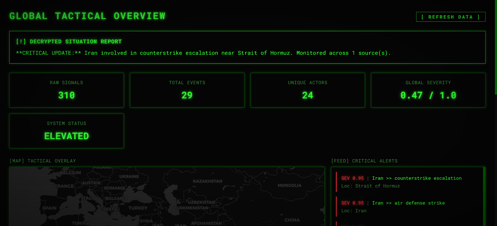
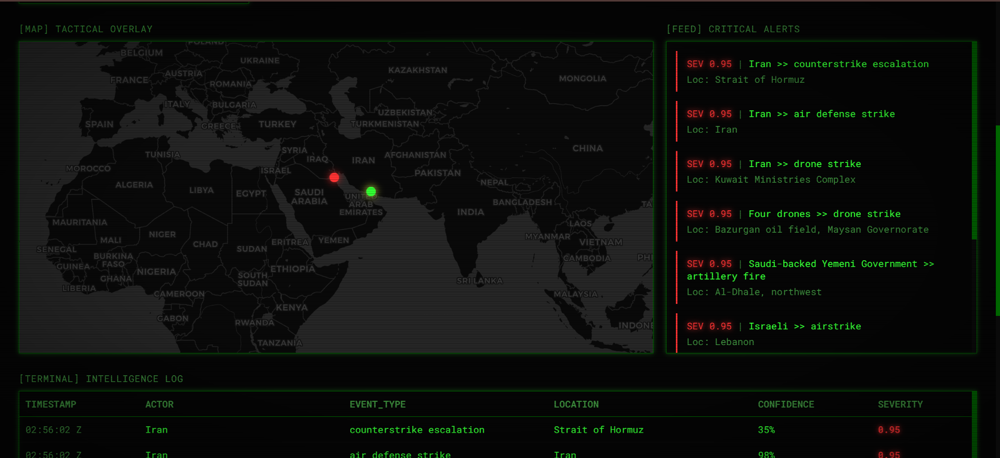
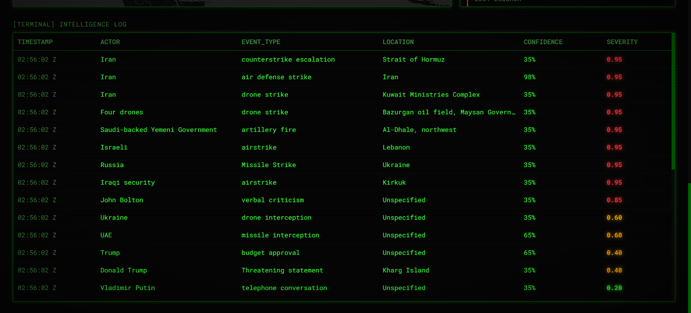

# 🌍 OSINT Conflict Monitoring System

**Candidate:** Shruti Bhale  
**Role:** Data Science / AI Engineering Candidate  

## 📊 System Visuals

<p align="center">
  
  
  
</p>

## 🎯 Project Overview
This repository contains an automated intelligence system designed to monitor open-source information regarding global conflicts. Built entirely from scratch, the system ingests unstructured text from multiple open-source intelligence (OSINT) channels, mathematically deduplicates the reporting, and extracts structured entities for a real-time tactical dashboard.

---

## 📂 Directory Structure

```text
osint-conflict-monitoring-system/
├── archive/                # V1 scripts: Initial NLP and regex attempts
├── backend/                # FastAPI Application
│   ├── services/
│   │   ├── ingestion.py    # Async scrapers (NewsAPI, Telegram, RSS)
│   │   ├── extraction.py   # LLM entity extraction (Groq API + Semaphores)
│   │   └── analysis.py     # DBSCAN clustering and Heuristic Scoring
│   ├── main.py             # App entry point and concurrency locks
│   ├── models.py           # Pydantic data schemas
│   └── cache.py            # TTL caching system
├── frontend/               # React + TypeScript Dashboard
│   ├── src/
│   │   ├── components/     # UI components (TacticalMap, DetailModal, etc.)
│   │   ├── pages/          # Dashboard views
│   │   └── index.css       # Tailwind configuration
├── data/                   # Local staging for SQLite and raw JSON outputs
├── screenshots/            # UI and terminal visualizations
├── requirements.txt        # Python backend dependencies
└── package.json            # React frontend dependencies
````

---

## 🧠 Intelligence Pipeline & Preprocessing Evolution

### Phase 1: Regex & Heuristics

Initial attempts used SpaCy NER and regex.

* ❌ Problem: Data was too noisy, unstructured, and inconsistent → poor accuracy.

### Phase 2: Naive LLM Integration

Introduced Groq API (LLaMA 3.1 8B).

* ❌ Problem:

  * API rate limits (`429 errors`)
  * SQLite locking issues from concurrent writes

### Phase 3: Production Architecture (Current)

✅ **Key Improvements:**

1. **Concurrency Locks**

   * Used `asyncio.Lock()` to prevent SQLite conflicts

2. **AI Throttling**

   * Top 50 alerts prioritized
   * `asyncio.Semaphore(5)` limits parallel LLM calls

3. **Semantic Deduplication**

   * Used `sentence-transformers` embeddings
   * Applied **DBSCAN clustering (>0.65 similarity)** to merge duplicate reports

---

## ⚙️ System Flow

Ingestion → Preprocessing → LLM Extraction → Embedding → Clustering (DBSCAN) → Dashboard Visualization

## 🛠️ Tech Stack

* **ML / Data Science:** sentence-transformers, DBSCAN
* **AI Extraction:** Groq API (LLaMA 3.1)
* **Backend:** Python, FastAPI, asyncio, Pydantic
* **Frontend:** React, TypeScript, Tailwind, Leaflet

---

## 🚀 Local Setup & Reproduction

### 1. Clone Repo

```bash
git clone https://github.com/shruti423/osint-conflict-monitoring-system.git
cd osint-conflict-monitoring-system
```

---

### 2. Create `.env`

```env
# AI Extraction
GROQ_API_KEY=your_groq_api_key_here

# OSINT Sources
NEWS_API_KEY=your_newsapi_key_here
TELEGRAM_API_ID=your_telegram_api_id
TELEGRAM_API_HASH=your_telegram_api_hash
```

---

### 3. Backend Setup (FastAPI)

```bash
# Create virtual environment
python -m venv venv
venv\Scripts\activate

# Mac/Linux:
# source venv/bin/activate

# Install dependencies
pip install -r requirements.txt

# Run server
cd backend
uvicorn main:app --reload
```

👉 Backend runs on: **[http://localhost:8000](http://localhost:8000)**

---

### 4. Frontend Setup (React + Vite)

```bash
cd frontend
npm install
npm run dev
```

👉 Frontend runs on: **[http://localhost:8080](http://localhost:8080)**

---

## ✅ Status

✔ Fully functional
✔ Handles real-world noisy OSINT data
✔ Scalable architecture with controlled concurrency
✔ Ready for evaluation / deployment

---

## 📌 Notes

* Ensure API keys are valid before running
* Telegram ingestion requires proper session authentication
* Designed for **real-time intelligence monitoring use cases**

---

## 💡 Final Thought

This project demonstrates not just technical implementation, but **engineering decision-making under real-world constraints** — including rate limits, concurrency, and data noise.

